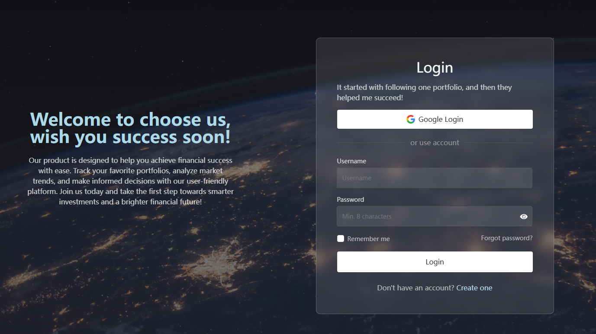
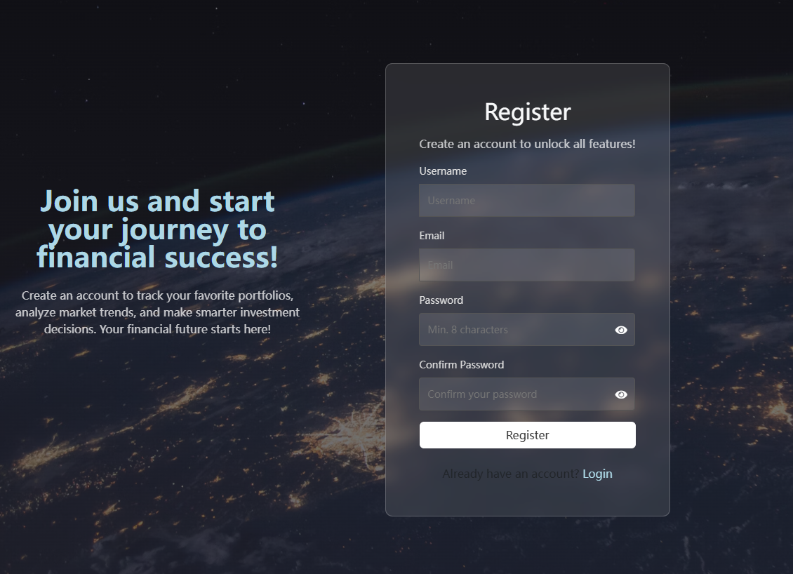
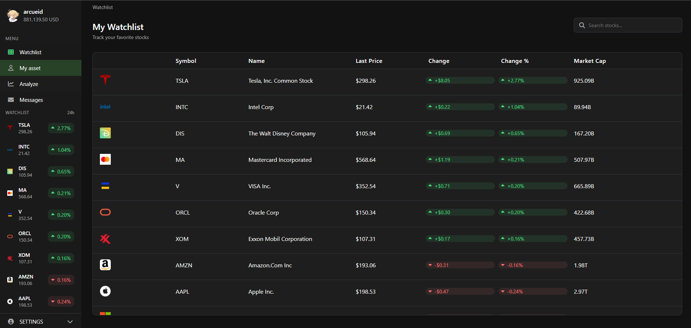
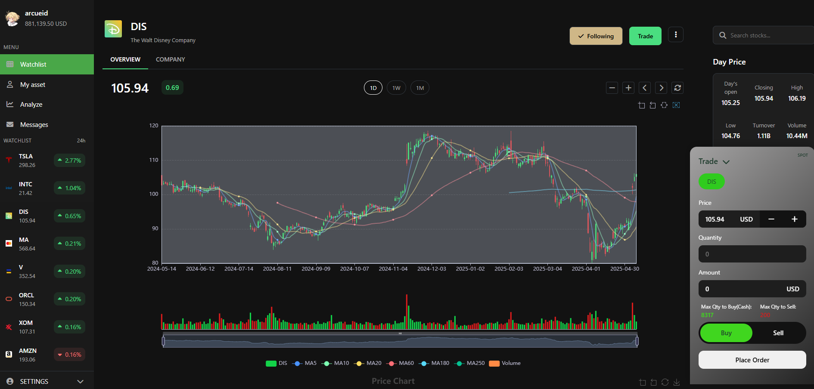
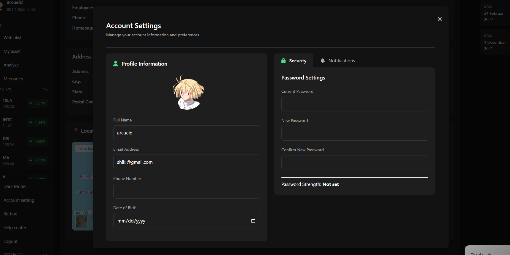
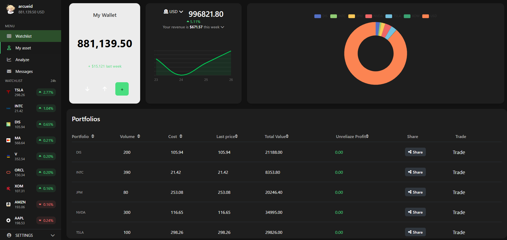
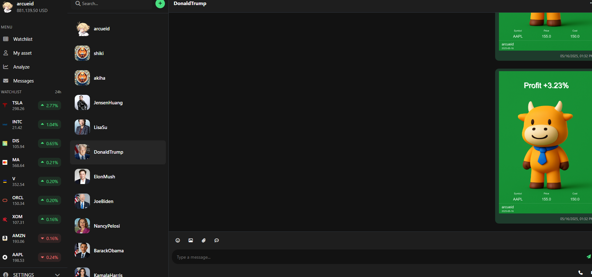
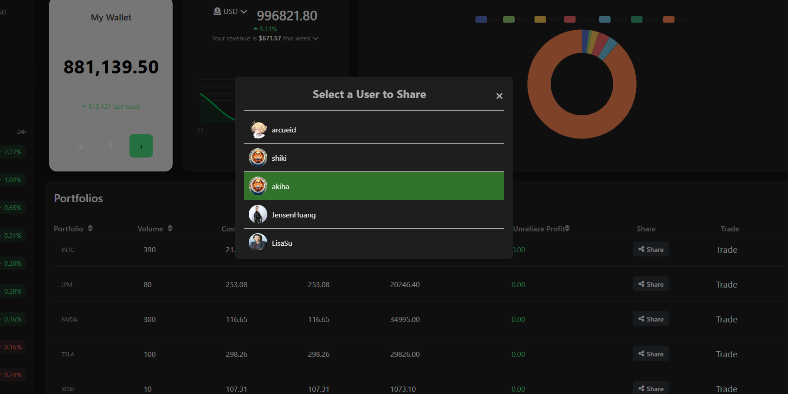
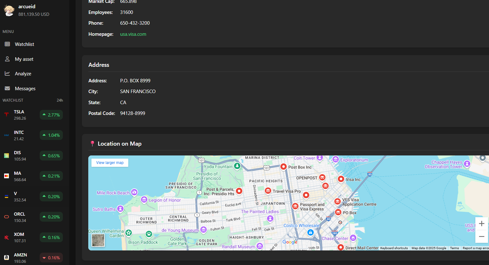

# CITS5505 Group Project Team 43

## Project Description

Stock Market Paper trading Web application

This project is a **Stock Market Paper Trading Web Application** that allows users to simulate stock trading in real-time. It is built using modern web technologies and frameworks to ensure a seamless and interactive user experience.
---

### Test User Accounts and Features

To explore the application, you can use the following test user accounts:

#### Test User 1:

- **Username:** `arcueid`
- **Password:** `12345678`

#### Test User 2:

- **Username:** `DonaldTrump` (e.g., `ElonMusk`)
- **Password:** `DonaldTrump` (same as the username)

---

### Application snapshot

Below are some screenshots showcasing the key features of the application:

1. **Login Page**  
   

2. **Registration Page**  
   

3. **Watchlist**  
   

4. **Ticker Information**  
   

5. **Settings Page**  
   

6. **Portfolio Overview**  
   

7. **Chat Feature**  
   

8. **Share Feature**  
   

9. **Company Information**  
   

### Key Features:

- **Client-Side Rendering (CSR):** Built with React for a dynamic and responsive frontend.
- **Backend Framework:** Flask is used to handle server-side logic and API endpoints.
- **Database Management:** SQLAlchemy is used for ORM to interact with the database efficiently.
- **Authentication:** JWT tokens are implemented for secure user authentication and session management.
- **Real-Time Messaging:** WebSocket is used to enable real-time updates and message sharing.
- **Data Visualization:** Apache ECharts is integrated for interactive and visually appealing stock charts.
- **API Integration:** Polygon API is used for fetching real-time stock market data.
- **Security:** CORS and CSRF tokens are implemented to ensure secure communication between the frontend and backend.
- **Testing:** Comprehensive testing is performed using Unittest, Selenium, and Pytest to ensure reliability and robustness.
- **Blueprint Architecture:** Flask Blueprints are used to organize the backend codebase effectively.
- **Database Migration:** Flask-Migrate is used to handle database schema changes seamlessly.

This application is designed to provide users with an intuitive and realistic stock trading experience while leveraging cutting-edge technologies for performance and scalability.

## Project Desgin

| UWA ID   | Name             | Github Username    |
| -------- | ---------------- | ------------------ |
| 24323312 | Jingtong Peng    | ArcueidShiki       |
| 24142141 | Alice Yuan       | Alice-Yuan0927     |
| 24300013 | Srinidhi Perala  | SrinidhiPerala2104 |
| 24312242 | Samradnyee Surve | samradnyees        |

## How to RUN

[See frontend Instructions](docs/StartFrontend.md)

[See backend Instructions](docs/StartBackend.md)
