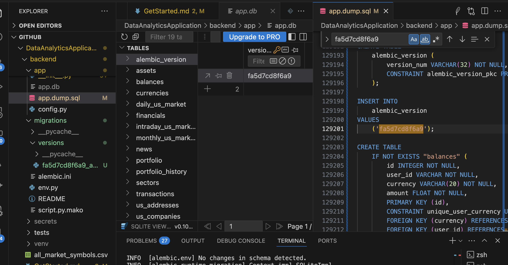

# How to Run

## Dev Mode (Debug Mode)

```bash
## python version 3.12.9
python -m venv venv

# For Linux/MacOs
source venv/bin/activate

# For windows only use command prompt, powershell doesn't work
venv\Scripts\activate.bat

# install python libraries
pip install -r requirements.txt

# update/sync the latest database schema changes
flask db upgrade

# !!!(only first time) initilize database with data
cd app # under backend/app directory
sqlite3 app.db < app.dump.sql # this will give your the initilial data to run the database

# under backend directory, cd ..
# start the backend
python run.py
```

## Run in Non-Debug Mode

```bash
#windows
set DEBUG=false
python run.py

# Linux
DEBUG=false python run.py
```

## Database Migration and Backup

Backup database and data in sql script file, in case of unexpected lossing data.

```bash
# under backend directory

# If there're any changes to databas schemas:
# Generate a migration script, every time the models changes
flask db migrate -m "What have changed in the models?"

# Apply the migration, when models changes
flask db upgrade

# dump all the data and scripts from database
# when you insert, update, or delete the data from database
# use this to save the snapshot of all data.
# it has to be plain text, UTF-8 encoded
sqlite3 app.db .dump > app.dump.sql

# so, anyone can initilize the database by running the following cmd
# portable for everyone
sqlite3 app.db < app.dump.sql

# Make sure the database version in migrations/versions/**_automatic_migrations.py is
# consistent with version in app.dump.sql
```


To view the app.db, start the backend and ensure you have installed the SQLite Viewer extension in VS Code or another IDE.

## Test

```bash
pytest
pytest -v
pytest /path
pytest tests/test_user.py
pytest tests/test_user.py::test_create_user
python -m unittest discover -s tests
python -m unittest tests.test_user

cd tests
coverage run -m pytest
coverage report
coverage html
```

## For API TEST

using postman

### Request Body

| Type                  | Content-Type                      | specifications                       | scenarios                                  |
| --------------------- | --------------------------------- | ------------------------------------ | ------------------------------------------ |
| form-data             | multipart/form-data               | single form, support file upload     | single form submit(includes files, images) |
| x-www-form-urlencoded | application/x-www-form-urlencoded | key-value single form（URL encoded） | form submit (browser default)              |
| raw - JSON            | application/json                  | JSON                                 | REST API (React Vue)                       |
| raw - text/plain      | text/plain                        | plain text                           | debug or self-defined                      |
| raw - XML             | application/xml                   | XML                                  | special systems                            |
| raw - HTML            | text/html                         | HTML                                 | Web editors                                |
| GraphQL               | application/graphql               | GraphQL query                        | GraphQL API                                |
| raw - JavaScript      | application/javascript            | JS code                              | remote script executio                     |

### Generate private and public key for RSA

you don't need to do that, the backend will auto generate them.

```bash
openssl genrsa -out rsa_private.pem 2048
openssl rsa -in rsa_private.pem -pubout -out rsa_public.pem
```

## HTTP STATUS CODE

All the http status codes are at here.

https://developer.mozilla.org/en-US/docs/Web/HTTP/Reference/Status

## Purify dependencies

```bash
pip install pipreqs
pipreqs ./your_project_path --force
```

https://yfinance-python.org/reference/yfinance.price_history.html
